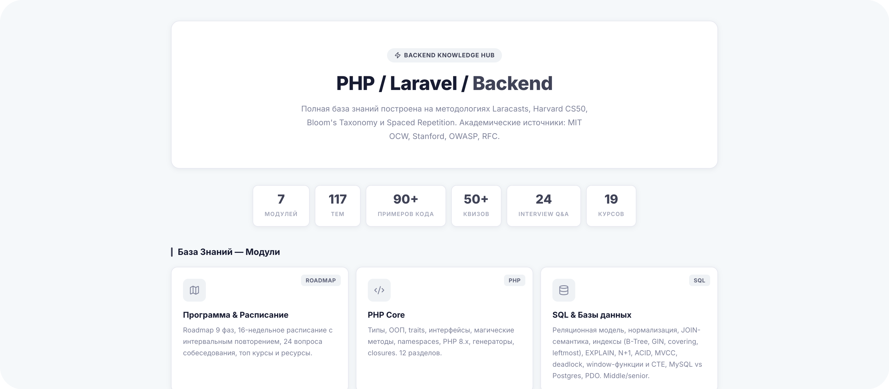
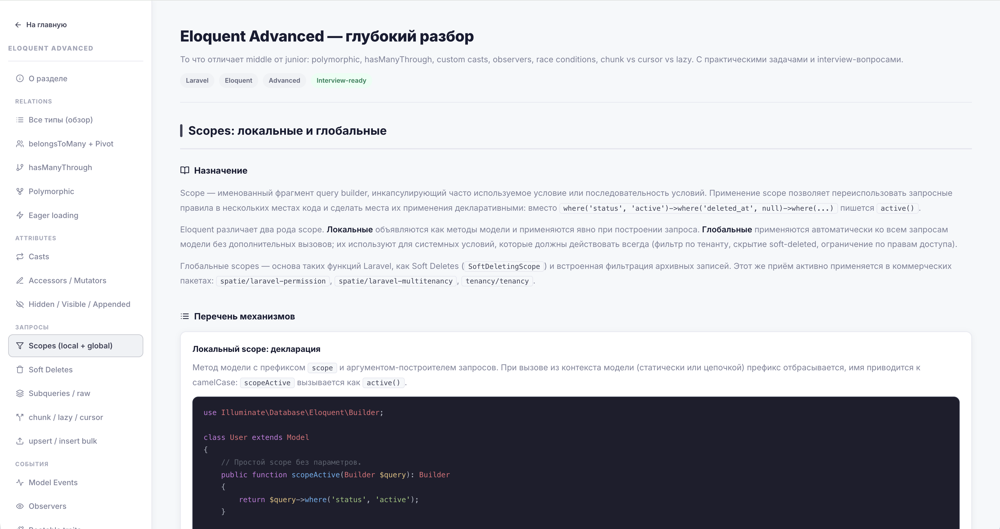

# Backend Knowledge Base

База знаний по backend-разработке: PHP, Laravel, SQL, безопасность, архитектура, тестирование, DevOps. Уровень middle/senior. Построена как Laravel-приложение с навигируемыми страницами.

## Скриншоты

<p align="center">
  
</p>

<p align="center">
  
</p>

## Содержание

| # | Раздел | Темы |
|---|---|---|
| KB_1 | PHP Core | Типы, ООП, traits, интерфейсы, магические методы, PHP 8.x, генераторы, closures |
| KB_2 | SQL и базы данных | Реляционная модель, типы, JOIN-ы, индексы (B-Tree/GIN/covering), EXPLAIN, ACID/MVCC, window-функции, MySQL vs PG vs MSSQL, PDO, partitioning, materialized views |
| KB_3 | Laravel | Request Lifecycle, Routing, Middleware, FormRequest, Eloquent, Cache, Queues, Events, Scheduler, Auth/Gates/Policies, Octane |
| KB_4 | Безопасность | Token Rotation, OAuth 2.0, JWT, CSRF, XSS, SQL Injection, CORS, Rate Limiting, HTTPS/TLS |
| KB_5 | Архитектура и паттерны | SOLID, Repository, Service, Factory, Observer, Strategy, DTO, DDD, Clean Architecture |
| KB_6 | Тестирование & DevOps | PHPUnit, Pest, TDD, Docker, Docker Compose, Git, CI/CD, Nginx, Deploy |
| KB_9 | Наследование & базовые классы | Что наследуют Controller, Model, FormRequest, Middleware, Job, Command |
| KB_10 | Хелперы & методы | Request, Validation, Eloquent, Collections, Str, Arr, Carbon, session, auth, routing |
| KB_11 | Cloud & DevOps — сети | Виртуализация, OSI/TCP-IP, MAC/IP, ARP/TCP/UDP, подсети, NAT, VLAN |
| KB_12 | Eloquent Advanced | Polymorphic relations, hasManyThrough, кастомные касты, observers, race conditions, chunk vs cursor |
| KB_13 | Service Container & DI | Bindings, contextual, tagged, autowiring, Service Providers, deferred, package providers |
| KB_14 | Тестирование — глубоко | Test doubles, дизайн тестов, DB-стратегии, parallel, time/queues, mutation testing, coverage, snapshot |

Дополнительно: страница «Программа & расписание» (KB_0) и дневное расписание.

## Стек

- **PHP 8.2+**
- **Laravel 11/12**
- **SQLite** (для локальной разработки; в проде &mdash; MySQL/PostgreSQL)
- **Blade** для рендеринга страниц
- **Lucide Icons** через CDN
- **Inter** шрифт через Google Fonts
- Стиль: Metronic Light theme (--primary: #404357)

## Запуск локально

```bash
cd kb-backend
composer install
cp .env.example .env
php artisan key:generate
touch database/database.sqlite
php artisan migrate --seed
php artisan serve
```

Открыть [http://127.0.0.1:8000](http://127.0.0.1:8000).

## Структура

```
.
├── kb-backend/              # Laravel-приложение
│   ├── app/                 # KbPageController, Module model
│   ├── database/
│   │   ├── migrations/      # Схема для таблицы modules
│   │   └── seeders/         # KbPagesSeeder с метаданными страниц
│   ├── resources/views/kb/  # Blade-страницы каждого раздела
│   └── routes/web.php       # Один контроллер, маршруты по slug
├── frontend/                # Статические HTML-версии (legacy)
└── obsidian-vault/          # Заметки в формате Obsidian (Markdown)
```

## Особенности архитектуры

- **Единый контроллер `KbPageController`** обрабатывает все KB-маршруты. Slug из URL → модель `Module` → blade-view из поля `file`.
- **Чистые URL** через регулярку `[A-Za-z0-9_-]+`. Старые `.html` редиректят 301.
- **Метаданные в БД** (заголовок, описание, badge, иконка, layout) — главная итерирует список из таблицы `modules`.
- **Два layout**: `sidebar` (фиксированное левое меню + контент) и `fullwidth` (топовая ссылка «На главную» + контент во всю ширину).

## Методология

Каждый раздел построен по принципам:

- **Bloom's Taxonomy** — от «Помню» до «Создаю»;
- **Active Recall** — блоки «Проверь себя» со скрытыми ответами;
- **Spaced Repetition** — нарастающие интервалы повторения (1/3/7/14 дней);
- **Project-Based Learning** — практические задания в конце разделов.

В каждой подсекции — 4 обязательных блока: **Назначение** / **Перечень компонентов** / **Практика на примере** / **Особые случаи** (6-8 pitfalls).

## Лицензия

Личный проект, MIT.
